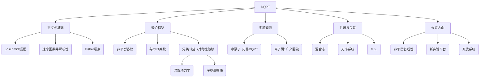

```mermaid
graph TD
  A[DQPT] --> B[定义与基础]
  A --> C[理论框架]
  A --> D[实验观测]
  A --> E[扩展与关联]
  A --> F[未来方向]
  
  B --> B1(Loschmidt振幅)
  B --> B2(速率函数非解析性)
  B --> B3(Fisher零点)
  
  C --> C1(非平衡协议)
  C --> C2(与QPT类比)
  C --> C3(分类: 拓扑/对称性破缺)
  C3 --> C31(涡旋动力学)
  C3 --> C32(序参量振荡)
  
  D --> D1(冷原子: 拓扑DQPT)
  D --> D2(离子阱: 广义回波)
  
  E --> E1(混合态)
  E --> E2(无序系统)
  E --> E3(MBL)
  
  F --> F1(非平衡普适性)
  F --> F2(新实验平台)
  F --> F3(开放系统)
```